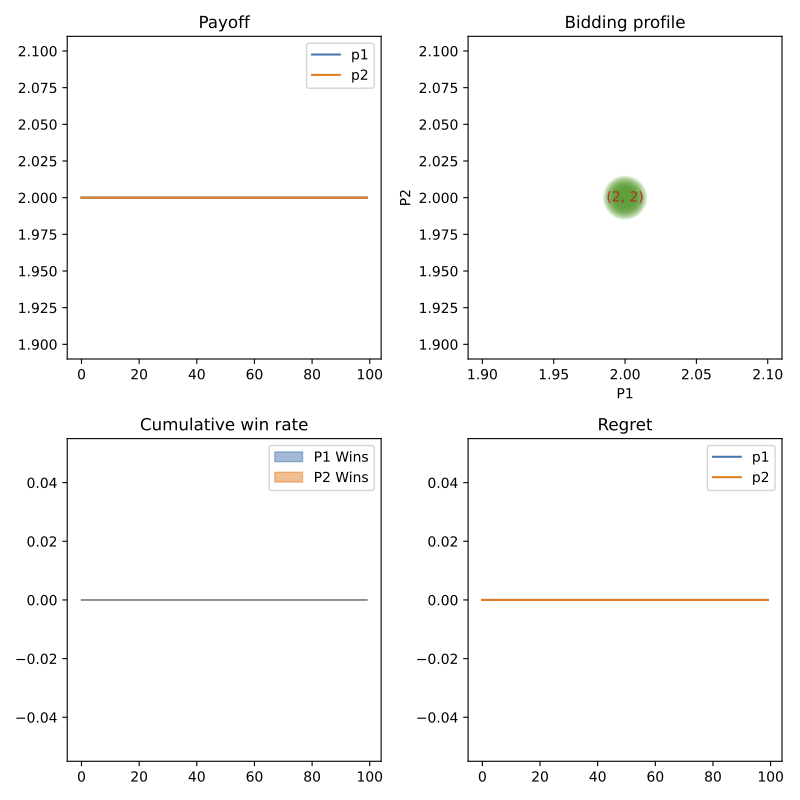
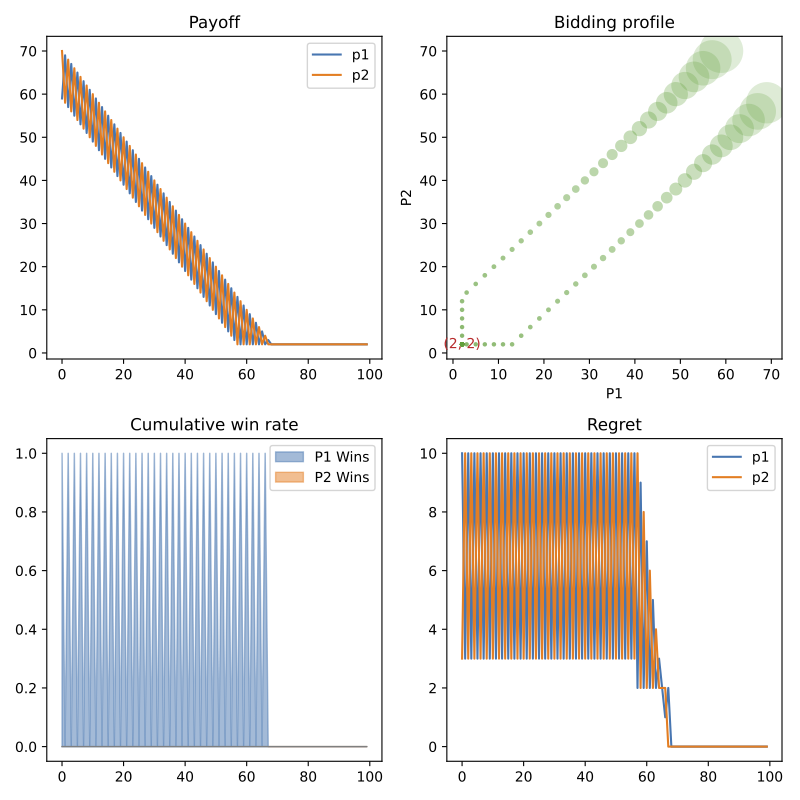
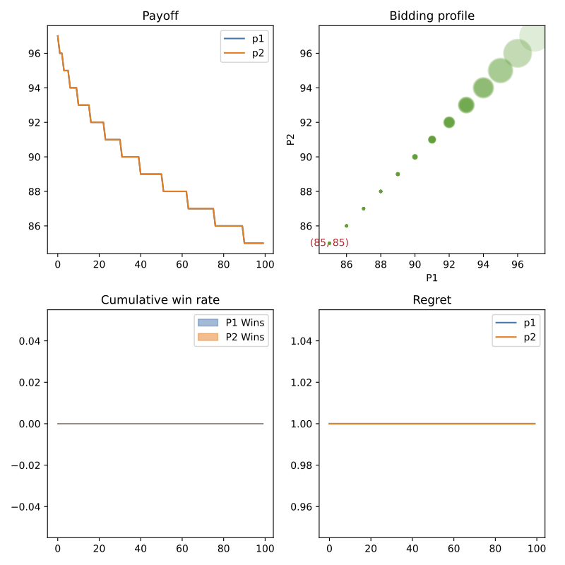
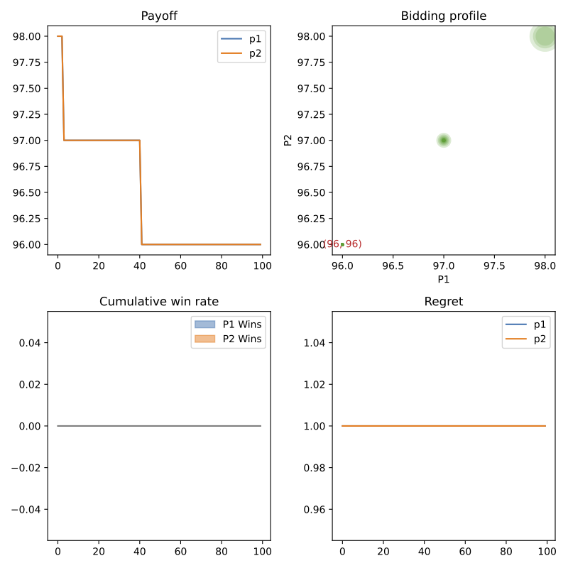

# Cognitive Hierarchy in the Iterated Traveler's Dilemma

This repo implements a few strategies for playing the *Iterated Traveler's Dilemma* (ITD), as an extension of the literature of the *Iterated Prisoner's Dilemma* (IPD).

### Currently implemented strategies

Some quick notations:

- $a_i^t$ denotes the action of agent $i$ in round $t$
- $u_i^t$ denotes the payoff (or utility / immediate reward) of agent $i$ in round $t$ 
- $N_{a_i}$ means the number of times this particular action $a_i \in \mathcal{A}_i$ has been played by agent $i$ up to this moment

| Strategies        | Rules                                                        | Note                         |
| ----------------- | ------------------------------------------------------------ | ---------------------------- |
| PerfectlyRational | $a_i^t \gets 2$                                              | Play NE                      |
| Memory1BR         | $a_i^t \gets max(a_j^{t-1}, 2)$                              | BR to the last step          |
| HistoryBR         | $a_j^{mixed} \gets Boltzmann({N_{a_{j}}})$, then $a_i^t \gets BR(a_j^{mixed})$ | BR to the hist. freq.        |
| TitForTat         | $a_i^t \gets a_j^{t-1}$                                      | Do whatever OP did last step |
| PoissonCH         | $\lambda \gets Gamma(N_{a_j})$, then $a_i^t \gets BR(a_j^{Poisson(\lambda)})$ | BR to the Poisson dist.      |

### Preliminary experimental results

###### 1. Perfectly rational agents start with the worse outcome and stay there forever

###### 2. Mutual best response to the previous actions will gradually go to the worst case 

###### 3. Best response considering the whole historical action sequnce helps end up in high-value outcome

###### 4. Best response while inferring opponents' rational levels leads to the best reciprocity

